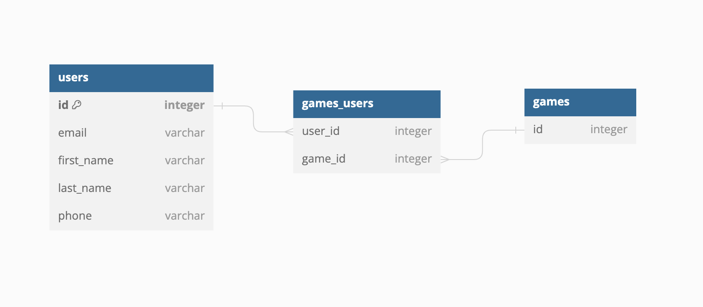

## NHL Model

#### Api Selection: 
- https://github.com/Zmalski/NHL-API-Reference?tab=MIT-1-ov-file

#### DB Schema: 
- Users table and game_id table (with many to many relationship)
- 
- All other data to be aqcuired on front end directly from API.

### End-points to hit for front-end

#### Server
- Predictions
  - Google BigQuery - odds/probabilities table
  - Model for this to make requests directly to big query
- Users
  - handled with Passport.js Oauth2.0 for google
  - /auth/login
  - /auth/register
 
#### NHL API
- Schedule
  - https://api-web.nhle.com/v1/schedule/now
- Teams
    - List: https://api.nhle.com/stats/rest/en/team
    - Standings: https://api-web.nhle.com/v1/standings/now
    - Individual team: https://api-web.nhle.com/v1/club-stats/TOR/now
    - Schedule: https://api-web.nhle.com/v1/club-schedule-season/TOR/now
    - Weekly Schedule: https://api-web.nhle.com/v1/club-schedule/TOR/week/2023-11-10
    - Roster: https://api-web.nhle.com/v1/roster/TOR/current
- Odds:
    - https://api-web.nhle.com/v1/partner-game/US/now"
- Games:
    - https://api-web.nhle.com/v1/gamecenter/2023020204/play-by-play

